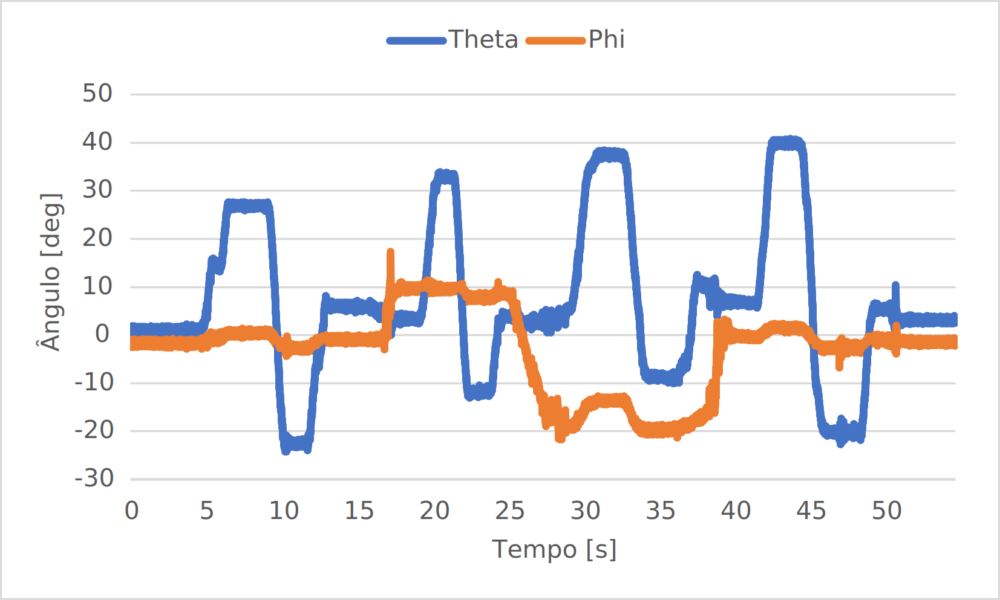

# Attitude Estimation Exame - Hexagon

by Klaus Edward Becker Begnis

## Task development

The task consisted of developing an algorithm that reads values from a log file with data aquired from an accelerometer.

The accelerometer in question is the [MMA8451Q](https://www.nxp.com/docs/en/data-sheet/MMA8451Q.pdf). When the data were aquired, the accelerometer was set to the 8*g* configuration. This configuration directly reflects the sensibility factor from the readings, as Table 1 presents.

#### Table 1		
| Configuration | Sensitivity       |
|---------------|-------------------|
| 2*g*          | 4098 [*counts/g*] |
| 4*g*          | 2048 [*counts/g*] |
| 8*g*          | 1024 [*counts/g*] |

### Calulating pitch and roll

The values obtained reflected acceleration values in a 3-axis system. To convert this values and discover the roll and pitch values in degrees, the subsequent [article](http://www.nxp.com/docs/en/application-note/AN3461.pdf) was followed.

In summary, the calculations needed to process these informations are presented at Equation 1-4, and each variable is presented at Table 2.

### Table 2
| Variable		| Unit       |
|---------------|-------------------|
| $\theta$      | *deg*				|
| $\phi$        | *deg*	 |
| $G_x$         | *g*	 |
| $G_y$         | *g*	 |
| $G_z$         | *g*	 |


### Equation 1

$\phi = tan^{-1}(\frac{G_y}{G_z})$

### Equation 2

$\phi = tan^{-1}\frac{G_y}{\sqrt{G_x^2 + G_z^2}}$

### Equation 3

$\theta = tan^{-1}\frac{-G_x}{\sqrt{G_y^2 + G_z^2}}$

### Equation 4

$\theta = tan^{-1}(\frac{-G_x}{G_z})$

As two solutions are found for each angle, and both have the same module but with opposite signals, to find the correct quadrant of the correct answer, the function $ATAN2(G_i,G_j)$ is used. Where for $\theta$ $i = x$ and $j = z$, while $i = y$ and $j = z$ for $\phi$.

### Code overview

The code was developed using the object orientation paradigm, which enriched the possibility to replicate the code and improved readability.

One class was designed for the log reading/writing, `LogReader`, and its attributes and methods are shown in Table 3 and Table 4, respectively.

### Table 3

| Attribute   | Type   | Visibility | Description                                |
|-------------|--------|------------|--------------------------------------------|
| `separator` | char   | private    | Character to separate values at log files. |
| `path`      | string | private    | Path to input log file.                    |
| `outputPath`    | string | private    | Path to output log file.                   |

### Table 4

| Method             | Type                 | Visibility | Description                                                                                           |
|--------------------|----------------------|------------|-------------------------------------------------------------------------------------------------------|
| `setPath`          | void                 | public     | Sets attribute `path`.                                                                                |
| `setOutputPath`    | void                 | public     | Sets attribute `outputPath`.                                                                          |
| `setSeparator`     | void                 | public     | Sets attribute `separator`.                                                                           |
| `translateLine`    | accelerometerReading | public     | Translates timestamp, $G_x$, $G_y$ and $G_z$ values.                                                  |
| `readAndTranslate` | void                 | public     | Classe's main method, start the process from reading and writing.                                     |
| `openFile`         | ifstream             | private    | Opens input log file.                                                                                 |
| `autoPath`         | string               | private    | Returns default name for output file. It's called only when output path not specfied.                 |
| `outputLineValue`  | string               | private    | String containing the line to be added at the output file. In the format: timestamp; $\theta$; $\phi$ |


Another important component from the code is the `accelerometerReading`. This struct was created to store the values from the $G_n$ information and perform mathematical calculations, such as those presented in Equations 1-4. It was chosen to utilize the C++ ```struct``` instead of a `class` because its methods were purely mathematical. This is a convention thaw was adopted while coding. Furthermore, the usage of a ```struct``` allows conversion to C language, which is an interesting feature when applied to an embedded system. This allows the conversion of the sensed values to degrees and the discovering the steering wheel orientation. The `LogReader` ```class``` wouldn't be used in an embedded system, since its purpose is to process data collection.

## How to use

To use this application, the first thing needed is to compile the project.

### Compiling the code

To compile the code, a compiler such as `gcc` or Visual Studio's `cl` must be installed.

To compile using Visual Studio's compiler, first open the developer command prompt. This can be either the `CMD Prompt` or `PowerShell`. Then, acess the repositorie directory and perform the following command:

```console
cl /EHsc AttitudeEstimationExam.cpp LogReader.cpp
```

This command will compile the program. Depending on the version of the compiler, some warnings may appear.

The output executable will be named as `AttitudeEstimationExam.exe`.

If `gcc` will be used, type in any console:

```console
gcc AttitudeEstimationExam.c LogReader.c
```

The `gcc` compiler wasn't tested, but it should work just fine.

### Executing the application

Both compilers will create an executable file. This file will contain all the necessary project information and will be where the application is run.

To use this file, you will need to specify one mandatory argument, which specifies the location of the log file to be read. Optionally, you can decide on the output file name.
Example:

```console
AttitudeEstimationExam.exe .\logs\attitude_exam.log
```

```console
AttitudeEstimationExam.exe .\logs\attitude_exam.log output.log
```


```console
AttitudeEstimationExam.exe .\logs\attitude_exam.log out
```
 
All of these commands will work properly. If no arguments are used, the application will inform the user about it and assist them with the required command.
However, the first example is not recommended. This is because it will overwrite the auto_out.log file, leading to the loss of data from previous estimations.
## Results

The file named `auto_out.log` has the output from the program's execution and contains the data needed for the exam.

The results were plotted using the external software Excel.
The result is showed as following:


